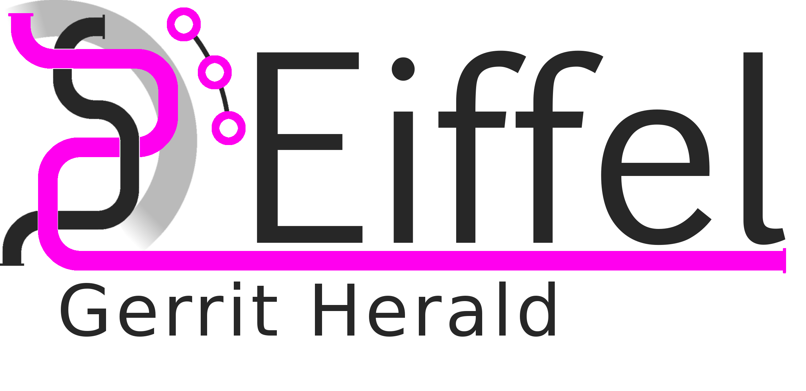

<!---
   Copyright 2018 Ericsson AB.
   For a full list of individual contributors, please see the commit history.

   Licensed under the Apache License, Version 2.0 (the "License");
   you may not use this file except in compliance with the License.
   You may obtain a copy of the License at

       http://www.apache.org/licenses/LICENSE-2.0

   Unless required by applicable law or agreed to in writing, software
   distributed under the License is distributed on an "AS IS" BASIS,
   WITHOUT WARRANTIES OR CONDITIONS OF ANY KIND, either express or implied.
   See the License for the specific language governing permissions and
   limitations under the License.
--->

# Eiffel Gerrit Herald
*(PoC)* This service listens to a RabbitMQ queue containing Gerrit events, converts them to Eiffel events and send them to a RabbitMQ exchange.

See supported events at https://github.com/eiffel-community/eiffel-gerrit-lib

# About this repository
The contents of this repository are licensed under the [Apache License 2.0](./LICENSE).

To get involved, please see [Code of Conduct](https://github.com/eiffel-community/.github/blob/master/CODE_OF_CONDUCT.md) and [contribution guidelines](https://github.com/eiffel-community/.github/blob/master/CONTRIBUTING.md).

# About Eiffel
This repository forms part of the Eiffel Community. Eiffel is a protocol for technology agnostic machine-to-machine communication in continuous integration and delivery pipelines, aimed at securing scalability, flexibility and traceability. Eiffel is based on the concept of decentralized real time messaging, both to drive the continuous integration and delivery system and to document it.

Visit [Eiffel Community](https://eiffel-community.github.io) to get started and get involved.

# Usage

### Prepare
Download and cd repo `git clone https://github.com/eiffel-community/eiffel-gerrit-herald.git && cd eiffel-gerrit-herald`

Set config in `src/main/resources/config.properties`. If you don't
want to store your configuration in the jar file that's produced by
the build, the `herald.properties` system property can be set to
contain the path to the property file to load instead of the one
built into the executable.

Additionally, if you run Gerrit Herald via Docker, the following
environment variables can be set to affect the program's runtime
behavior:

| Variable      | Meaning
| ------------- | --------
| HERALD_OPTS   | Options to pass to Eiffel Gerrit Herald itself. |
| JAVA_OPTS     | Options to pass to the JVM (e.g. "-Xmx1g -Dproperty=value"). |

### Build
`docker-compose build`

### Run
`docker-compose up -d`
